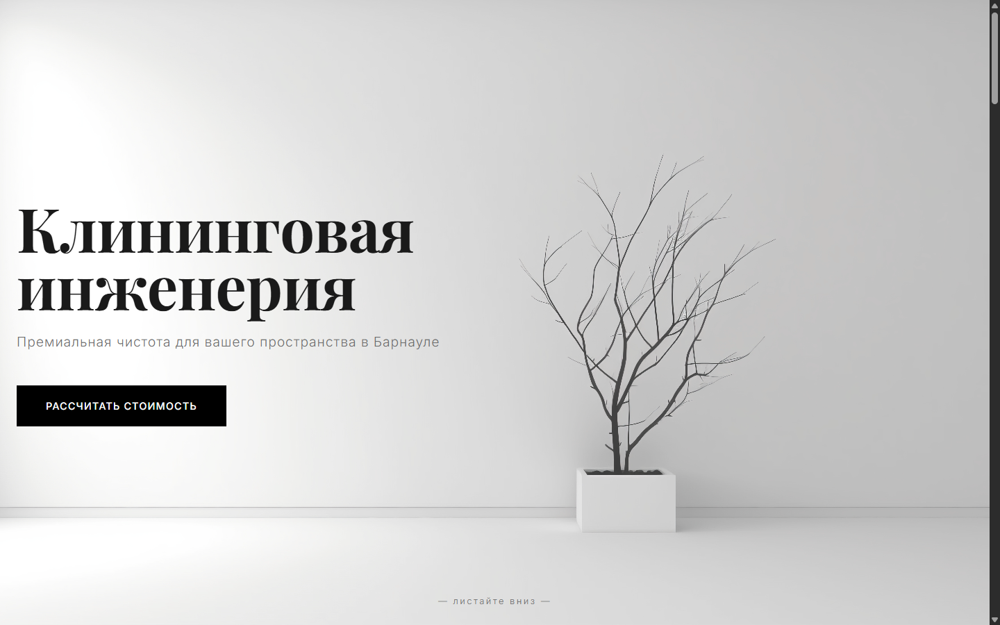

# 🧹 Expert Cleaning — лендинг клининговой компании

Премиальный лендинг для клининга.  
Минималистичный архитектурный дизайн, монохромная палитра, строгая типографика.  
Построен на React + TypeScript, Vite, CSS Modules.



## ✨ Ключевые особенности

- 🧼 **Калькулятор стоимости** с кастомным селектом и ползунком, пересчёт в реальном времени
- 📊 **Анимированные счётчики** (площади, химия, гарантия) при скролле
- 🖼 **Слайдер «До/После»** с перетаскиваемым разделителем (без сторонних библиотек)
- 💬 **Отзывы** с горизонтальным скроллом и кастомным рейтингом
- ❓ **FAQ-аккордеон** с плавным раскрытием
- 📍 **Яндекс.Карта** в футере с монохромным фильтром
- 🎨 Полностью кастомный дизайн без UI‑фреймворков — строгий, чёрно‑белый, «архитектурный»
- 📱 Адаптивная вёрстка (mobile‑first)
- ⚡ Быстрая загрузка благодаря Vite и отсутствию лишнего CSS

## 🛠️ Стек технологий

| Категория        | Библиотека / решение                     |
| ---------------- | ---------------------------------------- |
| Фреймворк        | React 19 + TypeScript                    |
| Сборка           | Vite                                     |
| Стили            | CSS Modules + CSS custom properties      |
| Анимации         | Framer Motion (пересчёт чисел)           |
| Иконки           | Feather Icons (react‑icons/fi)           |
| Отслеживание вьюпорта | react-intersection-observer          |
| Шрифты           | Playfair Display + Inter (Google Fonts)  |

## 🚀 Быстрый старт

### 1. Клонируй репозиторий
```bash
git clone https://github.com/Tomreet/expert-cleaning.git
cd expert-cleaning
2. Установи зависимости
bash
npm install
3. Добавь изображения
В папку public/images/ положи свои файлы:

text
public/
  images/
    hero-bg.jpg          # фон для Hero (архитектурный интерьер или чистое пространство)
    before-sample.jpg    # фото «до» уборки
    after-sample.jpg     # фото «после» уборки
    about.jpg            # командное фото или техника Karcher
    avatar.png           # аватар для отзыва (можно заглушку)
    og-preview.jpg       # превью для соцсетей и README
4. Запусти локально
bash
npm run dev
Открой http://localhost:5173 в браузере.

📁 Структура проекта
text
src/
  components/
    Hero/                # главный экран с заголовком и кнопкой
    Calculator/          # калькулятор (кастомный селект, слайдер)
    Stats/               # блок с анимированными цифрами
    Services/            # сетка услуг с иконками
    Gallery/             # слайдер сравнения «До/После»
    Reviews/             # отзывы (горизонтальный скролл)
    FAQ/                 # аккордеон «Полезная информация»
    About/               # блок «О компании» (текст + изображение)
    Footer/              # контакты и карта
  hooks/
    useCountUp.ts        # хук для плавного увеличения чисел
  styles/
    variables.css        # CSS-переменные (цвета, шрифты)
    global.css           # сброс стилей, базовые настройки
  App.tsx                # сборка всех секций
  main.tsx               # точка входа
🎨 Кастомизация
Цвета
Основные цвета заданы в src/styles/variables.css:

--color-bg — фон (#ffffff)

--color-bg-alt — серый фон для блоков (#f8f8f8)

--color-text — текст (#1a1a1a)

--color-accent — акцентный чёрный (#000000)

--color-border — рамки (#e0e0e0)

При необходимости измени эти переменные — обновится весь сайт.

Шрифты
Подключаются в index.html (Google Fonts):

Playfair Display — заголовки

Inter — основной текст

Контент
Все тексты и данные хранятся прямо в компонентах. Чтобы заменить услуги, цифры, отзывы или FAQ — отредактируй массивы в соответствующих файлах, например Services.tsx, Reviews.tsx, FAQ.tsx.